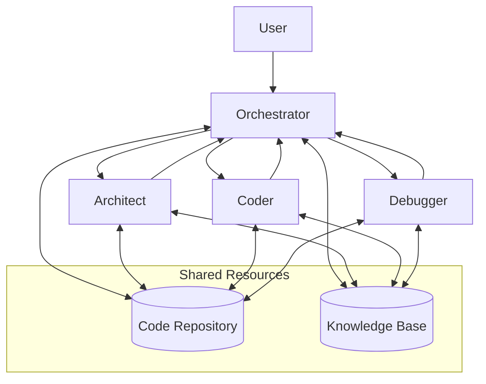
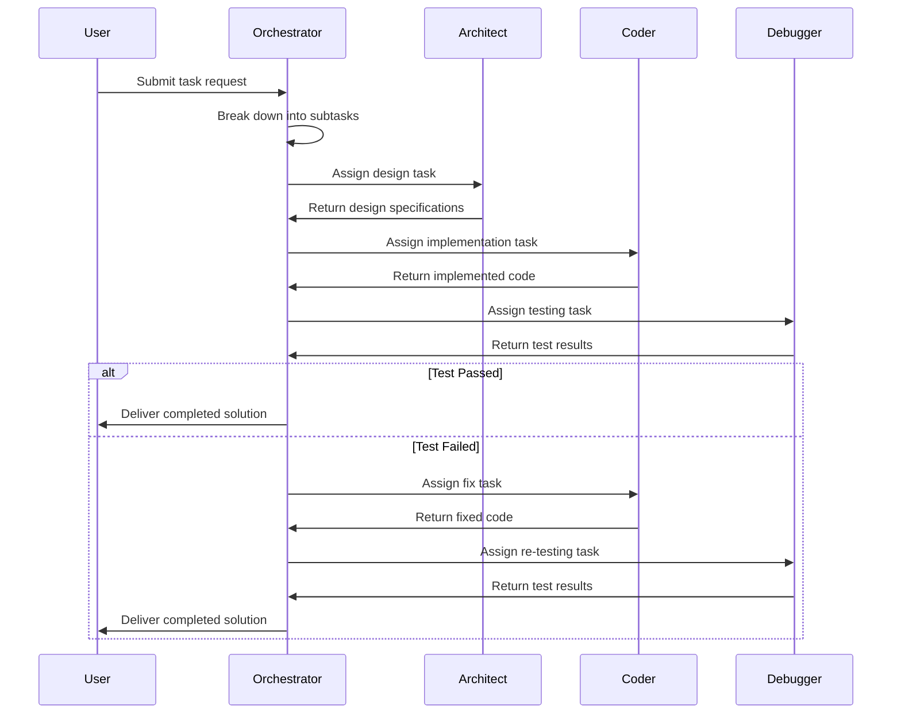
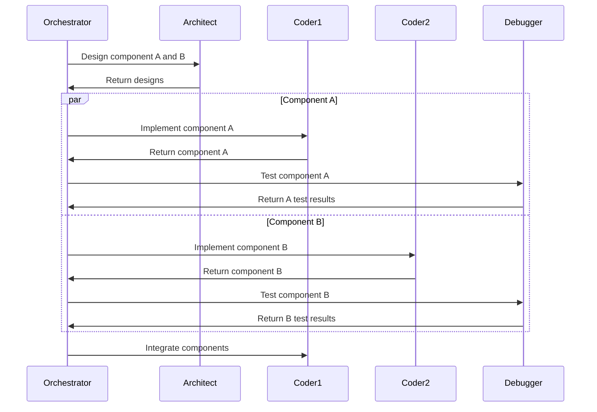
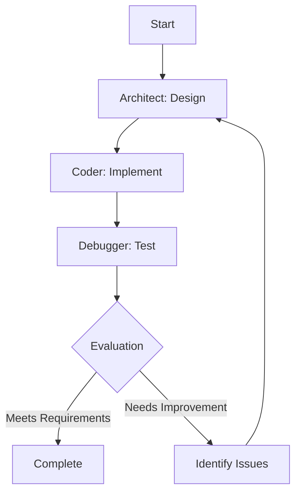
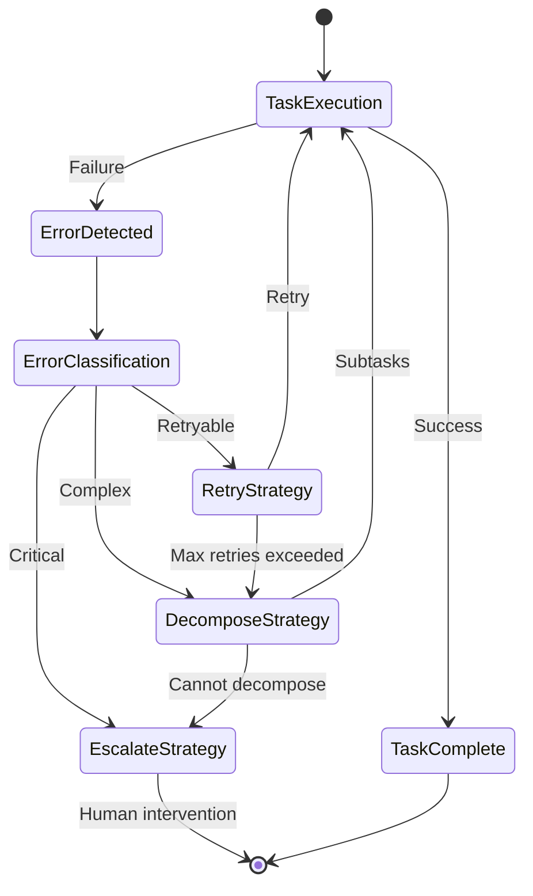
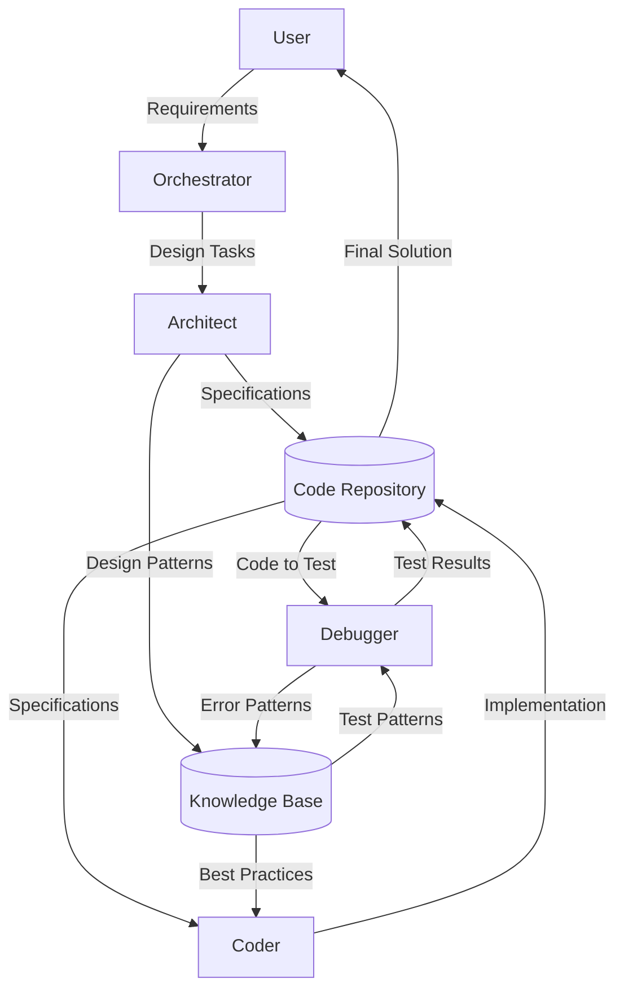
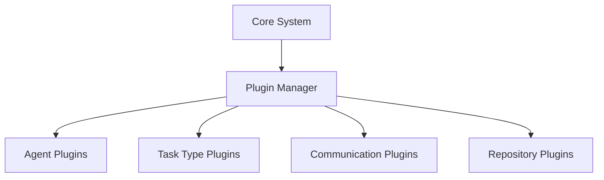

# ROOcode System Architecture Design Document

## 1. Introduction

This document outlines the architecture for a homebrewed ROOcode system, a multi-agent orchestration framework designed to automate complex coding and research workflows. The system coordinates multiple specialized AI agents to efficiently handle software development tasks, from initial design to debugging and maintenance.

### 1.1 Purpose

The ROOcode system aims to streamline software development by orchestrating specialized agents that work together to accomplish complex coding tasks. By dividing responsibilities among specialized components, the system can achieve higher quality results than a single agent approach.

### 1.2 Scope

This architecture defines:
- Core components of the ROOcode system
- Interfaces and communication protocols between components
- Workflow and execution models
- Error handling and recovery mechanisms
- Extensibility points for future enhancements

## 2. System Overview

The ROOcode system consists of four primary components:

1. **Orchestrator**: The central coordination hub that manages workflow execution, task delegation, and system state
2. **Architect**: Responsible for high-level system design, architecture decisions, and technical specifications
3. **Coder**: Implements code based on the Architect's specifications and handles code generation tasks
4. **Debugger**: Tests, validates, and fixes issues in the code produced by the Coder

### 2.1 High-Level Architecture



## 3. Component Specifications

### 3.1 Orchestrator

#### 3.1.1 Responsibilities
- Receive and interpret user requirements
- Break down complex tasks into subtasks
- Assign tasks to appropriate agents (Architect, Coder, Debugger)
- Track progress and manage workflow state
- Handle inter-agent communication
- Manage error recovery and retries
- Provide status updates to the user

#### 3.1.2 Interfaces
- **User Interface**: Accepts task requests and provides status updates
- **Agent Interface**: Communicates with specialized agents
- **Repository Interface**: Manages access to shared code and knowledge repositories

#### 3.1.3 State Management
The Orchestrator maintains the following state information:
- Current workflow status
- Task queue and dependencies
- Agent availability and capabilities
- Error states and recovery attempts

### 3.2 Architect

#### 3.2.1 Responsibilities
- Analyze requirements and create system designs
- Define component interfaces and data structures
- Create technical specifications for implementation
- Evaluate architectural trade-offs
- Ensure design patterns and best practices are followed

#### 3.2.2 Interfaces
- **Orchestrator Interface**: Receives design tasks and returns specifications
- **Repository Interface**: Stores and retrieves design artifacts

#### 3.2.3 Outputs
- System architecture diagrams
- Component specifications
- Interface definitions
- Data models
- Design rationales

### 3.3 Coder

#### 3.3.1 Responsibilities
- Implement code based on Architect's specifications
- Generate efficient, maintainable code
- Follow coding standards and best practices
- Document code appropriately
- Refactor existing code when necessary

#### 3.3.2 Interfaces
- **Orchestrator Interface**: Receives coding tasks and returns implementations
- **Repository Interface**: Stores and retrieves code artifacts

#### 3.3.3 Outputs
- Source code files
- Unit tests
- Code documentation
- Implementation notes

### 3.4 Debugger

#### 3.4.1 Responsibilities
- Test code against requirements
- Identify and diagnose bugs
- Fix issues or provide detailed error reports
- Validate code quality and performance
- Ensure edge cases are handled properly

#### 3.4.2 Interfaces
- **Orchestrator Interface**: Receives debugging tasks and returns validation results
- **Repository Interface**: Accesses code for testing and updates fixed code

#### 3.4.3 Outputs
- Test results
- Bug reports
- Fixed code
- Performance metrics
- Quality assessment reports

## 4. Communication Protocol

### 4.1 Message Schema

All inter-component communication uses a standardized JSON message format:

```json
{
  "message_id": "unique-identifier",
  "timestamp": "ISO-8601-timestamp",
  "sender": "component-name",
  "recipient": "component-name",
  "message_type": "task|response|status|error",
  "priority": "high|medium|low",
  "content": {
    "task_id": "task-identifier",
    "task_type": "specific-task-type",
    "payload": {},
    "metadata": {}
  }
}
```

### 4.2 Message Types

#### 4.2.1 Task Messages
Sent by the Orchestrator to assign work to agents:

```json
{
  "message_type": "task",
  "content": {
    "task_id": "task-123",
    "task_type": "design_component",
    "payload": {
      "component_name": "authentication",
      "requirements": ["req1", "req2"],
      "constraints": ["constraint1"]
    },
    "deadline": "ISO-8601-timestamp"
  }
}
```

#### 4.2.2 Response Messages
Sent by agents to return results to the Orchestrator:

```json
{
  "message_type": "response",
  "content": {
    "task_id": "task-123",
    "status": "completed|partial|failed",
    "result": {
      "artifacts": ["artifact1", "artifact2"],
      "notes": "Additional information"
    }
  }
}
```

#### 4.2.3 Status Messages
Sent by agents to provide progress updates:

```json
{
  "message_type": "status",
  "content": {
    "task_id": "task-123",
    "progress": 75,
    "stage": "current-stage",
    "estimated_completion": "ISO-8601-timestamp"
  }
}
```

#### 4.2.4 Error Messages
Sent by any component to report issues:

```json
{
  "message_type": "error",
  "content": {
    "task_id": "task-123",
    "error_code": "error-type-code",
    "severity": "critical|warning|info",
    "description": "Detailed error description",
    "context": {},
    "recovery_suggestion": "Suggested action to recover"
  }
}
```

### 4.3 Communication Channels

The system uses asynchronous message queues for inter-component communication:

1. **Task Queues**: Dedicated queues for each agent type
2. **Response Queue**: For completed task results
3. **Status Queue**: For progress updates
4. **Error Queue**: For error reporting and handling

## 5. Workflow Execution

### 5.1 Basic Workflow



### 5.2 Parallel Execution

For complex tasks, the Orchestrator can run multiple workflows in parallel:



### 5.3 Iterative Development

The system supports iterative development through feedback loops:



## 6. Error Handling and Recovery

### 6.1 Error Types

1. **Task Errors**: Issues with specific task execution
2. **Communication Errors**: Message delivery or format problems
3. **Resource Errors**: Issues with accessing shared resources
4. **Logic Errors**: Incorrect implementation or design decisions
5. **System Errors**: Infrastructure or environment problems

### 6.2 Recovery Strategies

1. **Retry**: Attempt the same task again (with or without modifications)
2. **Reassign**: Assign the task to a different agent
3. **Decompose**: Break the task into smaller subtasks
4. **Escalate**: Request human intervention
5. **Rollback**: Revert to a previous stable state

### 6.3 Error Handling Workflow



## 7. Data Management

### 7.1 Shared Repositories

#### 7.1.1 Code Repository
Stores all code artifacts, including:
- Source code
- Tests
- Documentation
- Build configurations

#### 7.1.2 Knowledge Base
Stores shared knowledge, including:
- Design patterns
- Best practices
- Previous solutions
- Error patterns and resolutions

### 7.2 Data Flow



## 8. Component Implementation

### 8.1 Orchestrator Implementation

```python
class Orchestrator:
    def __init__(self):
        self.task_queue = Queue()
        self.agents = {
            'architect': Architect(),
            'coder': Coder(),
            'debugger': Debugger()
        }
        self.workflow_state = {}
        
    def submit_task(self, task):
        """Submit a new task to the orchestrator"""
        task_id = self._generate_task_id()
        self.workflow_state[task_id] = {
            'status': 'submitted',
            'subtasks': [],
            'results': {}
        }
        subtasks = self._break_down_task(task)
        for subtask in subtasks:
            self.task_queue.put(subtask)
            self.workflow_state[task_id]['subtasks'].append(subtask['id'])
        return task_id
        
    def process_tasks(self):
        """Process all tasks in the queue"""
        while not self.task_queue.empty():
            task = self.task_queue.get()
            agent_type = self._determine_agent_type(task)
            agent = self.agents[agent_type]
            try:
                result = agent.execute_task(task)
                self._handle_result(task, result)
            except Exception as e:
                self._handle_error(task, e)
                
    def _handle_result(self, task, result):
        """Process task results"""
        task_id = task['parent_id']
        self.workflow_state[task_id]['results'][task['id']] = result
        
        # Check if all subtasks are complete
        if self._all_subtasks_complete(task_id):
            if self._all_subtasks_successful(task_id):
                self.workflow_state[task_id]['status'] = 'completed'
            else:
                self._handle_workflow_failure(task_id)
                
    def _handle_error(self, task, error):
        """Handle task execution errors"""
        # Implement error recovery strategies
        recovery_strategy = self._determine_recovery_strategy(task, error)
        if recovery_strategy == 'retry':
            self.task_queue.put(task)  # Retry the same task
        elif recovery_strategy == 'decompose':
            subtasks = self._decompose_task(task)
            for subtask in subtasks:
                self.task_queue.put(subtask)
        elif recovery_strategy == 'escalate':
            # Implement escalation logic
            pass
```

### 8.2 Architect Implementation

```python
class Architect:
    def __init__(self):
        self.knowledge_base = KnowledgeBase()
        
    def execute_task(self, task):
        """Execute an architecture design task"""
        if task['type'] == 'system_design':
            return self._design_system(task['requirements'])
        elif task['type'] == 'component_design':
            return self._design_component(task['component'], task['requirements'])
        elif task['type'] == 'interface_design':
            return self._design_interface(task['components'], task['requirements'])
        else:
            raise ValueError(f"Unknown task type: {task['type']}")
            
    def _design_system(self, requirements):
        """Create a high-level system design"""
        # Implementation details
        return {
            'system_diagram': '...',
            'components': [...],
            'interfaces': [...],
            'data_models': [...]
        }
        
    def _design_component(self, component, requirements):
        """Design a specific component"""
        # Implementation details
        return {
            'component_name': component,
            'responsibilities': [...],
            'interfaces': [...],
            'internal_structure': '...'
        }
        
    def _design_interface(self, components, requirements):
        """Design interfaces between components"""
        # Implementation details
        return {
            'interface_name': '...',
            'methods': [...],
            'data_formats': [...],
            'communication_patterns': '...'
        }
```

### 8.3 Coder Implementation

```python
class Coder:
    def __init__(self):
        self.knowledge_base = KnowledgeBase()
        self.code_repository = CodeRepository()
        
    def execute_task(self, task):
        """Execute a coding task"""
        if task['type'] == 'implement_component':
            return self._implement_component(task['component'], task['specification'])
        elif task['type'] == 'implement_interface':
            return self._implement_interface(task['interface'], task['specification'])
        elif task['type'] == 'refactor_code':
            return self._refactor_code(task['code'], task['requirements'])
        elif task['type'] == 'fix_bug':
            return self._fix_bug(task['code'], task['bug_report'])
        else:
            raise ValueError(f"Unknown task type: {task['type']}")
            
    def _implement_component(self, component, specification):
        """Implement a component based on specifications"""
        # Implementation details
        code = self._generate_code(specification)
        self.code_repository.save(component, code)
        return {
            'component': component,
            'code': code,
            'documentation': self._generate_documentation(component, code)
        }
        
    def _implement_interface(self, interface, specification):
        """Implement an interface based on specifications"""
        # Implementation details
        code = self._generate_interface_code(specification)
        self.code_repository.save(interface, code)
        return {
            'interface': interface,
            'code': code,
            'documentation': self._generate_documentation(interface, code)
        }
        
    def _fix_bug(self, code, bug_report):
        """Fix a bug in the code"""
        # Implementation details
        fixed_code = self._analyze_and_fix(code, bug_report)
        return {
            'original_code': code,
            'fixed_code': fixed_code,
            'changes': self._document_changes(code, fixed_code)
        }
```

### 8.4 Debugger Implementation

```python
class Debugger:
    def __init__(self):
        self.knowledge_base = KnowledgeBase()
        self.code_repository = CodeRepository()
        
    def execute_task(self, task):
        """Execute a debugging task"""
        if task['type'] == 'test_component':
            return self._test_component(task['component'], task['requirements'])
        elif task['type'] == 'validate_interface':
            return self._validate_interface(task['interface'], task['specification'])
        elif task['type'] == 'performance_test':
            return self._performance_test(task['component'], task['metrics'])
        else:
            raise ValueError(f"Unknown task type: {task['type']}")
            
    def _test_component(self, component, requirements):
        """Test a component against requirements"""
        code = self.code_repository.get(component)
        test_results = self._run_tests(code, requirements)
        if test_results['passed']:
            return {
                'component': component,
                'status': 'passed',
                'test_results': test_results
            }
        else:
            return {
                'component': component,
                'status': 'failed',
                'test_results': test_results,
                'bug_report': self._generate_bug_report(test_results)
            }
            
    def _validate_interface(self, interface, specification):
        """Validate an interface implementation against its specification"""
        code = self.code_repository.get(interface)
        validation_results = self._validate(code, specification)
        return {
            'interface': interface,
            'status': 'valid' if validation_results['valid'] else 'invalid',
            'validation_results': validation_results
        }
        
    def _performance_test(self, component, metrics):
        """Run performance tests on a component"""
        code = self.code_repository.get(component)
        performance_results = self._measure_performance(code, metrics)
        return {
            'component': component,
            'performance_results': performance_results,
            'recommendations': self._generate_performance_recommendations(performance_results)
        }
```

## 9. Extensibility and Customization

### 9.1 Plugin Architecture

The ROOcode system supports a plugin architecture to extend functionality:



### 9.2 Custom Agent Integration

New specialized agents can be integrated by implementing the Agent interface:

```python
class CustomAgent(Agent):
    def __init__(self, name, capabilities):
        super().__init__(name)
        self.capabilities = capabilities
        
    def execute_task(self, task):
        # Custom implementation
        pass
        
    def get_capabilities(self):
        return self.capabilities
```

### 9.3 Workflow Customization

Custom workflows can be defined using a workflow definition language:

```json
{
  "workflow_id": "custom_workflow",
  "name": "Custom Development Workflow",
  "stages": [
    {
      "name": "requirements",
      "agent": "architect",
      "task_type": "analyze_requirements",
      "next": "design"
    },
    {
      "name": "design",
      "agent": "architect",
      "task_type": "system_design",
      "next": "implementation"
    },
    {
      "name": "implementation",
      "agent": "coder",
      "task_type": "implement_component",
      "next": "testing"
    },
    {
      "name": "testing",
      "agent": "debugger",
      "task_type": "test_component",
      "next": "review"
    },
    {
      "name": "review",
      "agent": "custom_reviewer",
      "task_type": "code_review",
      "next": null
    }
  ]
}
```

## 10. Deployment Considerations

### 10.1 System Requirements

- Python 3.8+ runtime environment
- Message queue system (RabbitMQ, Redis, or similar)
- Storage for code repository and knowledge base
- Sufficient computational resources for AI agent operations

### 10.2 Scalability

The system can scale horizontally by:
- Adding more instances of each agent type
- Partitioning the task queue by domain or priority
- Implementing a distributed orchestrator for high-volume workflows

### 10.3 Security

- All inter-component communication should be encrypted
- Access to the code repository and knowledge base should be authenticated
- User inputs should be validated to prevent injection attacks
- Sensitive information should be stored securely

## 11. Conclusion

This architecture document provides a comprehensive design for a homebrewed ROOcode system that orchestrates multiple AI agents for software development tasks. The modular design, standardized communication protocols, and robust error handling mechanisms ensure the system can handle complex workflows while remaining extensible for future enhancements.

By implementing this architecture, we can create a powerful multi-agent system that leverages specialized components to automate and streamline the software development process, from initial design to debugging and maintenance.
